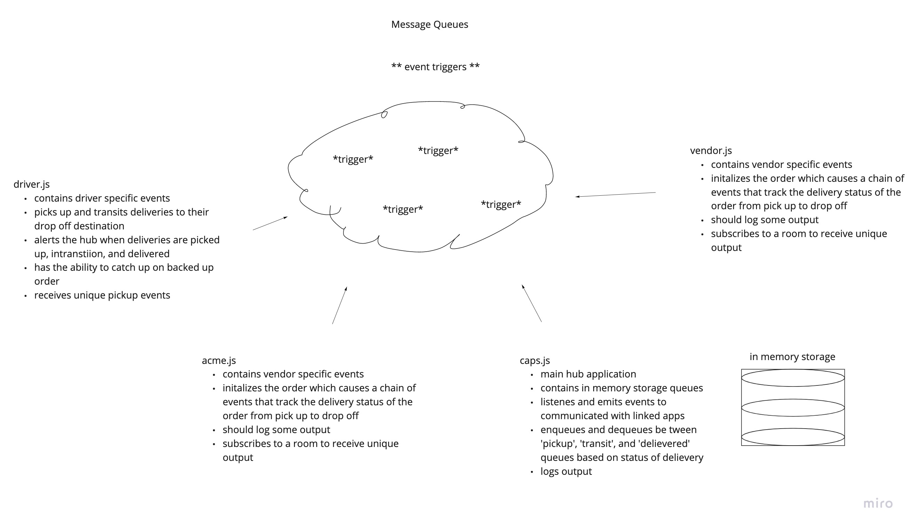

# LAB - Class 13

## Project: Message Queues

### Author: Jenner Dulce

### Links and Resources

- [Pull Request](https://github.com/jennerdulce/queue-server/pull/1)
- [ci/cd](https://github.com/jennerdulce/queue-server/actions)

### Setup

#### How to initialize/run your application (where applicable)

- `node caps.js`
- `node driver.js`
- `node vendor.js`
- `node acme.js`
- npm i
  - socket.io-client@2
  - socket.io@2
  - dotenv
  - jest
  - faker

#### How to use your library (where applicable)

#### Tests

##### caps.js

- Main Hub App
- contains in memory storage queues
- listens and emits events to communicate with linked apps
- should log some output

##### driver.js

- picks up and transits delieveries to their drop off destination
- alerts the hub when delieveries are picked up, in transition, and delievered
- has the ability to catch up on backed up orders when turned off
- should log some output

##### vendor.js

- initializes the order which causes a chain of events of the whole delievery process
- emits a trigger that states delievery has been received and deletes the delievery off the queue
- should log some output

##### acme.js

- initializes the order which causes a chain of events of the whole delievery process
- emits a trigger that states delievery has been received and deletes the delievery off the queue
- functions should log some output

#### UML

;
